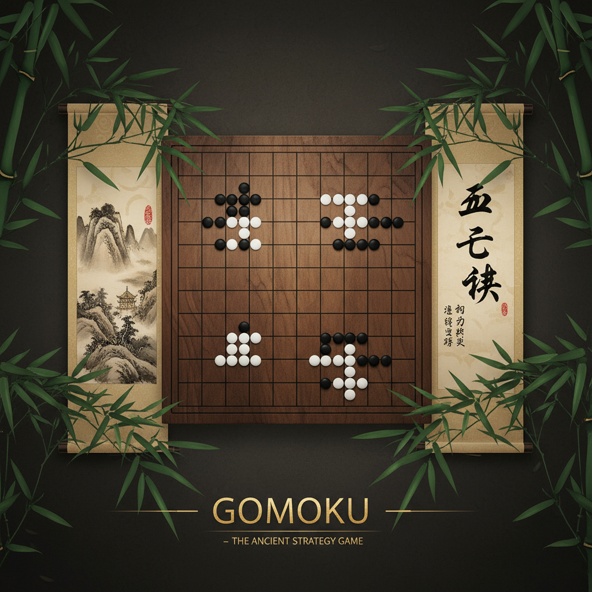

# 五子棋技能系统 - 古韵新风

一个融合传统五子棋与现代技能机制的策略对战游戏，通过四字成语命名的技能系统增强游戏趣味性，同时保持核心策略性。



## 🎮 项目特色

- **传统与现代融合**：在经典五子棋基础上引入技能系统，保持策略性的同时增加趣味性
- **四字成语命名**：所有技能均使用四字成语命名，体现中华文化底蕴
- **技能自定义**：支持玩家创建和分享自定义技能，发挥创意
- **精美视觉设计**：采用"古韵新风"设计理念，墨色山水配色方案
- **响应式设计**：完美适配桌面端和移动端设备

## 🚀 快速开始

### 在线体验
直接访问 [游戏页面](index.html) 开始游戏！

### 本地运行
1. 克隆或下载项目到本地
2. 使用任意HTTP服务器运行项目（推荐使用Live Server）
3. 在浏览器中打开 `index.html`

```bash
# 使用Python启动本地服务器
python -m http.server 8000

# 或使用Node.js
npx http-server

# 或使用Live Server（VS Code插件）
# 右键点击index.html -> Open with Live Server
```

## 🎯 游戏规则

### 基础规则
- 15×15标准棋盘
- 黑白双方轮流落子
- 横、竖、斜向连成五子者获胜
- 支持连五、长连等标准胜利条件

### 技能系统
每方拥有8种独特技能，使用能量系统进行管理：

#### 攻击类技能
- **飞沙走石** - 移除对手场上任意一颗棋子（消耗2⚡，冷却3回合）
- **釜底抽薪** - 移除对手最近放置的3颗棋子（消耗3⚡，冷却5回合）

#### 控制类技能
- **时光冻结** - 使对手跳过下一回合（消耗2⚡，冷却4回合）
- **画地为牢** - 指定3×3区域，对手2回合内不能落子（消耗2⚡，冷却4回合）

#### 防御类技能
- **固若金汤** - 使我方棋子2回合内不可被移除（消耗1⚡，冷却3回合）
- **移花接木** - 将我方棋子移动到相邻空位（消耗1⚡，冷却2回合）

#### 特殊类技能
- **时光倒流** - 撤销对手上一步的落子操作（消耗3⚡，冷却5回合）
- **力拔山兮** - 随机打乱场上所有棋子位置（消耗4⚡，冷却7回合）

### 能量系统
- 每方初始拥有3点能量
- 每回合自动恢复1点能量（上限5点）
- 使用技能消耗对应能量点数

## 🎨 技能自定义

### 创建技能
1. 访问 [技能自定义页面](custom-skills.html)
2. 使用四字成语命名技能
3. 选择技能类型和效果
4. 调整能量消耗和冷却时间
5. 预览效果并保存

擒擒拿拿：撤回对手的上一步操作，并且暂停对手一个回合
东山再起：把棋盘恢复到上一回合的状态并增加一颗棋子

保洁上门：随机移除对方棋子（数量不等0-3颗）

你这个畜生！

你骂老人！

拾金不昧：

静如止水：

水滴石穿：

两极反转： 张呈图片随机移动

寻衅滋事：打对面血


### 设计原则
- 技能名称必须为四字成语
- 效果需与成语含义相关
- 必须符合平衡原则
- 通过审核机制确保游戏公平性

## 📚 游戏教程

访问 [教程页面](tutorial.html) 学习：
- 五子棋基础规则
- 技能系统使用方法
- 实战策略技巧
- 高级组合技

## 🛠️ 技术实现

### 前端技术栈
- **HTML5 Canvas** - 棋盘渲染
- **JavaScript ES6+** - 游戏逻辑
- **CSS3** - 界面样式和动画
- **Anime.js** - 动画效果
- **p5.js** - 粒子效果
- **Matter.js** - 物理效果

### 核心模块
- **游戏引擎** - 棋盘状态管理和胜利检测
- **技能系统** - 技能效果执行和冷却管理
- **动画系统** - 落子动画和技能特效
- **UI管理** - 界面更新和用户交互
- **音效系统** - 游戏音效和背景音乐

### 项目结构
```
skillGomoku/
├── index.html              # 主游戏页面
├── custom-skills.html      # 技能自定义页面
├── tutorial.html           # 游戏教程页面
├── main.js                 # 主要游戏逻辑
├── resources/              # 资源文件夹
│   ├── hero.png           # Hero图像
│   ├── background.png     # 背景图片
│   ├── board-texture.png  # 棋盘纹理
│   └── skills/            # 技能图标
│       ├── feishazoushi.png
│       ├── shiguangdaoliu.png
│       ├── libashanxi.png
│       ├── shiguangdongjie.png
│       ├── guruojintang.png
│       ├── yihuajiemu.png
│       ├── huadweiliao.png
│       └── fudichouxin.png
├── design.md              # 视觉设计文档
├── game-design.md         # 游戏设计文档
├── interaction.md         # 交互设计文档
└── outline.md            # 项目大纲
```

## 🎨 视觉设计

### 设计理念
采用"古韵新风"设计理念，将传统中国围棋文化与现代游戏美学相结合。

### 色彩系统
- **墨色** (#1a1a1a) - 主要文字和边框
- **宣纸白** (#faf9f6) - 背景和棋盘
- **竹青** (#2d5016) - 装饰和强调
- **朱砂** (#b22222) - 警告和重要提示
- **金箔** (#d4af37) - 技能和特效

### 字体系统
- **标题字体** - Ma Shan Zheng（书法风格）
- **正文字体** - Noto Sans SC（现代简洁）
- **技能名称** - ZCOOL XiaoWei（传统风格）

## 📱 响应式设计

### 桌面端
- 三栏布局：玩家信息 | 棋盘 | 技能面板
- 完整功能展示
- 鼠标悬停效果

### 移动端
- 单栏布局，技能面板位于底部
- 触摸优化操作
- 自适应棋盘大小

## 🔧 开发计划

### 已完成功能
- ✅ 基础五子棋游戏逻辑
- ✅ 8种预设技能系统
- ✅ 技能自定义功能
- ✅ 游戏教程系统
- ✅ 响应式界面设计
- ✅ 动画效果系统

### 计划功能
- 🔄 在线多人对战
- 🔄 技能平衡性调整
- 🔄 成就系统
- 🔄 排行榜功能
- 🔄 音效系统完善
- 🔄 多语言支持

## 🤝 贡献指南

欢迎提交Issue和Pull Request！

### 贡献方式
1. Fork 项目
2. 创建功能分支
3. 提交更改
4. 发起 Pull Request

### 开发规范
- 遵循现有代码风格
- 添加必要的注释
- 确保功能测试通过
- 更新相关文档

## 📄 许可证

本项目采用 MIT 许可证 - 查看 [LICENSE](LICENSE) 文件了解详情

## 🙏 致谢

- 感谢所有测试玩家的反馈
- 感谢开源社区提供的优秀库
- 感谢中华文化的深厚底蕴

## 📞 联系我们

如有问题或建议，请通过以下方式联系：

- 提交 [Issue](../../issues)
- 发送邮件至：ruihuang13@iflytek.com

---

**享受游戏，传承文化！** 🎮✨
